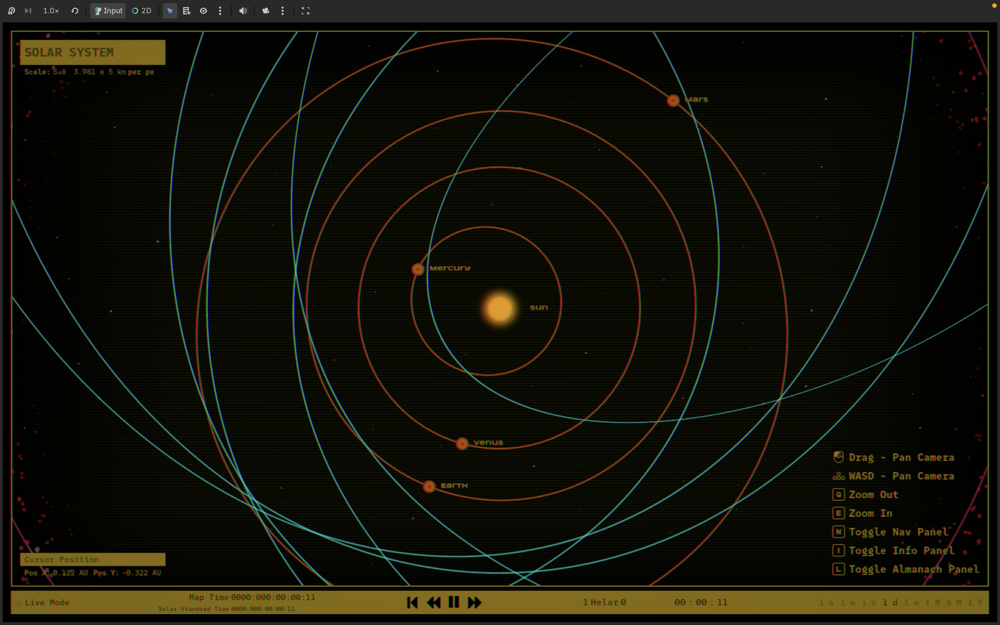
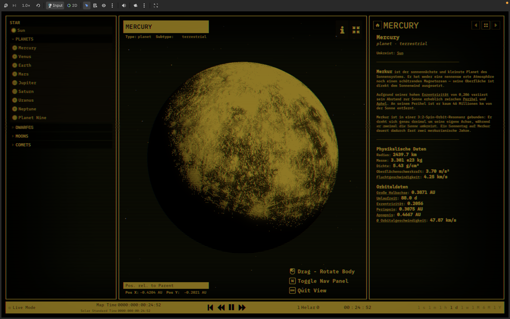

# Final Frontier

An interactive map of our solar system, built in Godot 4 with help from Claude. Fully explorable and with its own internal wiki, providing context and information about each celestial body. This project is a proof of concept for a larger space exploration game, called Final Frontier. The basic vision is "Sid Meiers Pirates in Space".

## Features

- [x] Interactive map of our solar system
- [x] Basic Wiki system
- [x] Planet viewer
